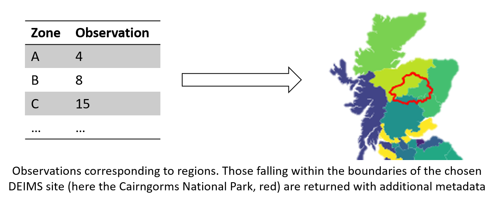
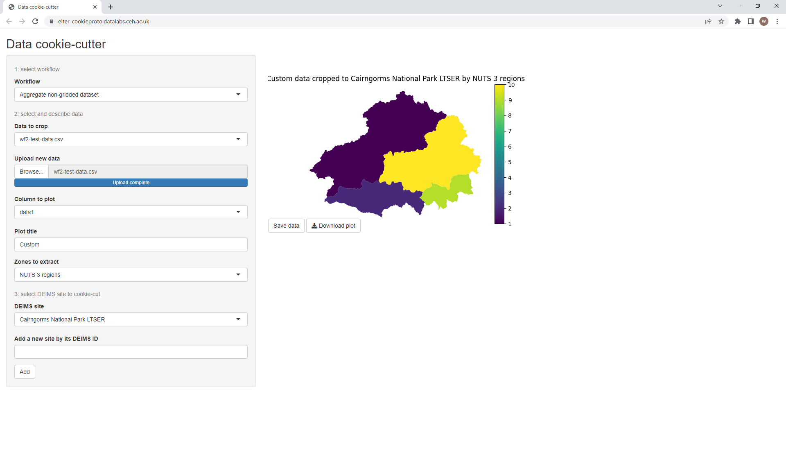

# spatial-data-processor, AKA "The Cookie-Cutter"
Spatial data workflows with an RShiny interface for the eLTER community.

This README describes the repository at a high level.
In the `documentation` folder there are additionally:
- *tutorials* for beginners
- *how-to* guides covering specific tasks in detail
- *reference* materials which document technical details of the system
- *general* materials which cover everything else.

## About
This repository revolves around two primary codebases:
- `analyse.py`, which defines workflows for processing spatial data
- `app.R`, a web-based user interface to said workflows.

The workflows all extract data relevant to a chosen [DEIMS site](https://deims.org) from input data.
They are written in Python 3 using third-party libraries, documented in each workflow's [reference](documentation/reference/) material.

The interface is written in R using the [Shiny framework](https://shiny.rstudio.com/), using [reticulate](https://rstudio.github.io/reticulate/) to call the workflows.

Going through the [tutorial](documentation/tutorials/user-introduction.md) is highly recommended for newcomers to understand the purpose of the workflows and interface.

## Workflows
Initially, two workflows have been developed.

[The first (wf1)](documentation/reference/wf1.md) works with geospatial raster data.
The user can upload raster data and the data is cropped to the boundaries of the chosen DEIMS site.
The cropped data can be downloaded along with a plot which is displayed as a preview.

[The second (wf2)](documentation/reference/wf2.md) works with "tabular" data (e.g. CSV, spreadsheets, etc.) representing observations associated with spatial regions (e.g. counties, census zones).
The entries corresponding to regions falling within the boundaries of a chosen DEIMS site are filtered, previewed and made available for download, with additional spatial metadata attached.
The following diagram illustrates the filtering process.

## Interface
To provide easy access to the workflows, an R Shiny interface is provided.
It allows users to graphically upload data, set the workflow parameters and then save the results for further analysis.
As new options are chosen, the site updates the preview so that results can be checked by eye before saving.

## Installation
The complete system is provided as a service in UKCEH's [DataLabs](https://datalab.datalabs.ceh.ac.uk/) platform, in which it has been developed.
You are welcome to install the system elsewhere using the [installation guide](documentation/howto/install.md) provided.

## Sources
Sample data (`data` folder)
- Scottish birth data: https://statistics.gov.scot/home
- Nitrous oxide data (`totaln2o17.asc` converted to GeoTIFF): https://naei.beis.gov.uk/data/map-uk-das

Shapefiles
- DEIMS sites: https://deims.org/
- EU NUTS regions: https://ec.europa.eu/eurostat/web/gisco/geodata/reference-data/administrative-units-statistical-units/nuts
- EU LAU regions: https://ec.europa.eu/eurostat/web/gisco/geodata/reference-data/administrative-units-statistical-units/lau
- National statistical zone spatial data is cited in each relevant DEIMS directory (e.g. `shapefiles/deims/cairngorms` for Scottish data)

European Commission NUTS 2016 data © EuroGeographics for the administrative boundaries
