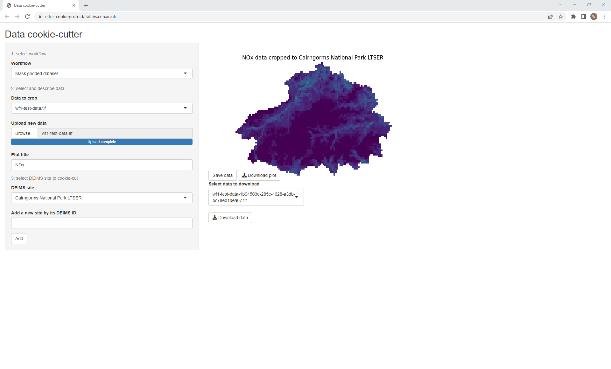
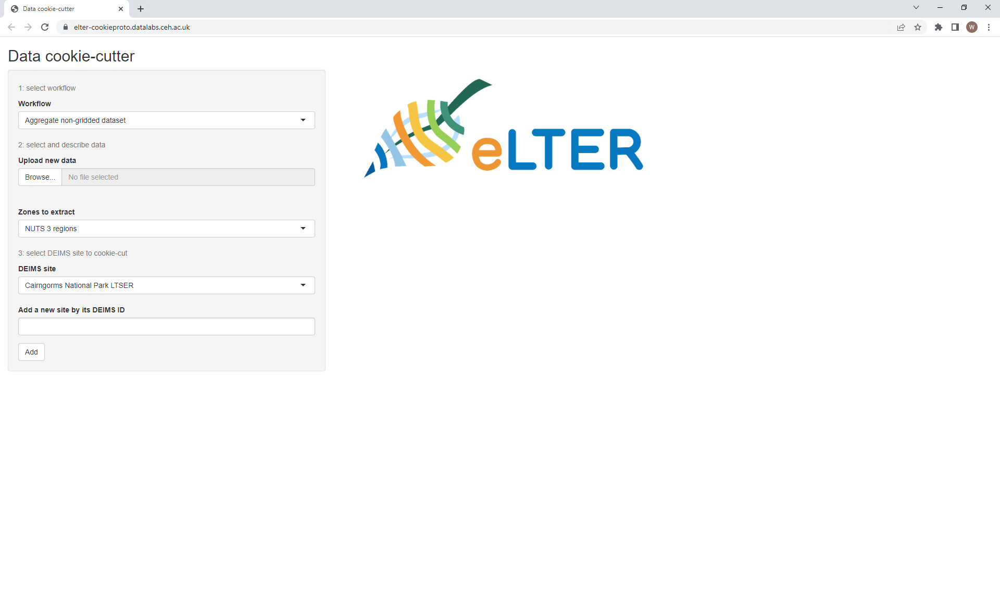
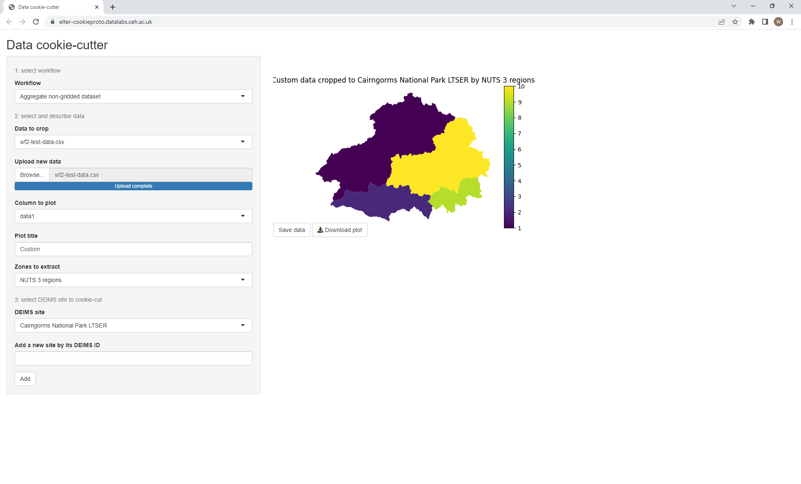
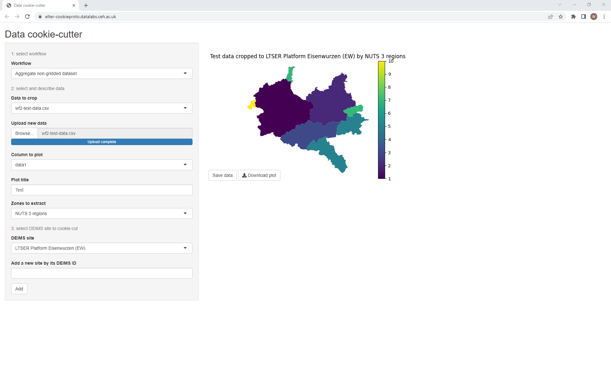
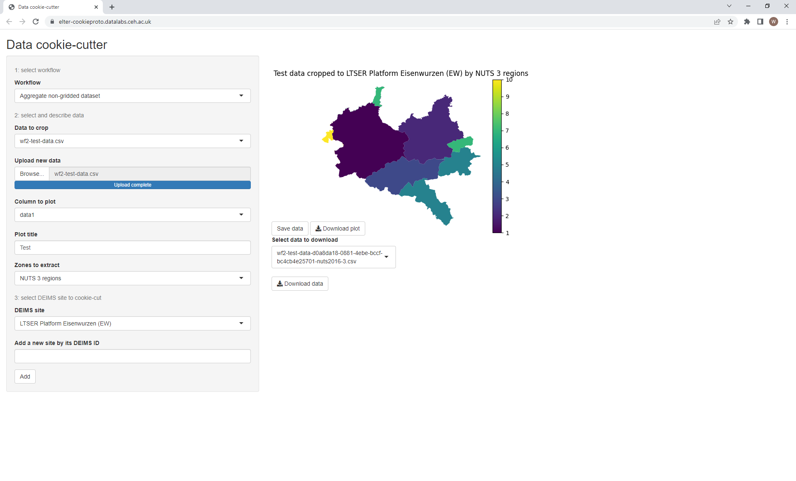

# Beginner's introduction
This tutorial will guide you through how to use both of the inbuilt workflows by working with example data.
It should take around 10 minutes in total.

## Before you start
Access to the tool, either in [DataLabs](https://datalab.datalabs.ceh.ac.uk/) or with an instance you have installed yourself (see the [installation guide](../howto/install.md)) is required.
You will also need to download `wf1-test-data.tif` and `wf2-test-data.tif` from the top-level `data` folder if you haven't cloned the repository to your machine.

*Note: this tutorial describes the system as of version `1.0`.
Newer versions may be slightly different to what's described here.*

## Processing raster data with workflow 1
### Introduction
To illustrate the first workflow, we will use the `wf1-test-data.tif` file.
This is a GeoTIFF file of Nitrous Oxide (NOx) emissions data across the whole of the UK, where higher values in each pixel correspond to greater pollution levels.
You can open it with most standard image viewing programs or GIS software to see for yourself.

Now imagine you're doing research into air quality in the [Cairngorms national park](https://deims.org/1b94503d-285c-4028-a3db-bc78e31dea07).
This data includes what you want (since the Cairngorms are in the UK) but also lots of data you don't necessarily need (i.e. the whole rest of the country).
Workflow 1 will extract only the pixels which fall within the boundaries of the Cairngorms and discard the rest, leaving just the data you want for you to process further.

### Exercise
#### Data upload
Open the tool in your browser.
You will be greeted with the interface for workflow 1 on the left-hand side, as it is the default when opening the application.

The grey box on the left-hand side is where all of the options are for you to set, while the right-hand side is reserved for output.
At the moment, only the eLTER logo is showing as there is no input data for the system to work with yet.

Let's get started then - use the "Browse..." button (labelled "Upload new data") to select the `wf1-test-data.tif` file you downloaded earlier.
When the upload finishes, you should see this:

#### Settings
Uh oh!
What happened?
A few things, actually, but the most obvious is that the eLTER logo has been replaced with an error message!
This is because as soon as we uploaded our data, the system tried to extract the portion of the data which covers the DEIMS site we've chosen.
If you look at the "DEIMS site" option, you may see why an error has appeared.

Unless you skipped ahead, you won't have chosen a DEIMS site yet!
So the default site "LTSER platform Lautaret-Oisans / Zone Atelier Alpes" is still selected.
Since the Alps aren't in the UK (much as I wish they were), the system is throwing an error as there is no overlap between the data and our DEIMS site.

That's OK though, if we change that option to "Cairngorms National Park LTSER" (our site of interest), you should now see a preview.

Because data was extracted successfully, the resulting data is plotted to the right of the interface.
This is primarily so you can quickly check that the result is what you're expecting and catch any errors.

Additionally, a new box has appeared called "Data to crop", which is set to the name of our file, `wf1-test-data.tif`.
This appears when data has been loaded into the application to show which input data is being used.
When multiple inputs are available you can toggle between them using this option.
Incidentally, since the application now has a copy of your data you could close your browser and come back later - the data will still be there.

Another new box has also appeared called "Plot title".
We can describe our dataset here, so go ahead and type in "NOx" in this box.
Once you've done that, the title of the plot on the right should automatically update itself.
The rest of the title is generated based on the options you have selected.

#### Output
Since the data looks correct at a glance (compare the plot with a satellite image of the Cairngorms if you like) we can now save our new dataset.
Click "Save data" and the result will be saved on the system with an auto-generated filename.

Like when we added our input data, a new box "Select data to download" has appeared on the right, along with a "Download data" button.

Use the download button to save the dataset to your machine.
You can inspect this as before to make sure that only the Cairngorms data is returned.

As a convenience, the option to download the preview plot is available at any time - of course, you may prefer to create images from the raw data yourself.
Download the generated plot by clicking "Download plot" and the preview will be saved as `plot.png`.

#### Further reading
For more detailed information on how workflow 1 operates, as well as for troubleshooting tips, please read [the reference documentation](../reference/wf1.md).

## Processing tabular data with workflow 2
### Introduction
To illustrate the second workflow, we will use the `wf2-test-data.tif` file.
This is a csv file of random data for the whole of Europe, grouped by NUTS 2016 regions.
Each region at levels 0-3 has three values (`data1`, `data2` and `data3`) which are random integers from 1-10 inclusive.
Open it in a text editor or spreadsheet program to see how it's structured.

Now imagine you're analysing European statistical data for the [LTSER Platform Eisenwurzen (EW)](https://deims.org/d0a8da18-0881-4ebe-bccf-bc4cb4e25701).
This data includes what you want (since Eisenwurzen is in Europe) but also lots of data you don't necessarily need (i.e. the whole rest of the continent).
Workflow 2 will extract only the rows of regions which fall within the boundaries of Eisenwurzen and discard the rest, leaving just the data you want for you to process further.
It will also give you some information about how much of each region sits within the site.

### Exercise
#### Data upload
*Note: to avoid repetition, some of the interface elements that function the same as in workflow 1 aren't described in detail here.
If something seems poorly-explained, go through the workflow 1 tutorial.*

Open the tool in your browser and select "Aggregate non-gridded dataset" in the "Workflow" dropdown.
The screen will change slightly to the interface for workflow 2.

As before, we can upload our data `wf2-test-data.tif` using the "Browse..." button on the left.
When the upload finishes, you should see a preview on the right like so:

Again, because data was extracted successfully, the resulting data is plotted to the right of the interface.
This time, the site boundaries have been plotted with NUTS regions superimposed (by default, NUTS 3) and coloured by the data.
If you started with the workflow 1 tutorial, note that our choice of DEIMS site, the Cairngorms, has carried over to this workflow.

#### Settings
Like before, now that data is in the system we have a few more options which will allow us to tweak the workflow output.

The first new option is "Column to plot", which sets which column will be used to colour each region in the preview/plot.
Since our data is all numbers, a continuous colour scale is used.
This setting only affects the plot - no matter what's chosen here, the final output data will be the same.

The second is "Zones to extract", which sets which regions to search for in the data.
This is done by matching IDs/codes in the first column with known region IDs, e.g. the NUTS ID for NUTS regions.
For example, a row whose first value is "UKM71" will be included in the output if the Cairngorms and NUTS 3 regions are chosen, as "UKM71" is "Angus and Dundee City" which falls within the Cairngorms boundaries.

Our dataset covers the whole of Europe and all sites, so go NUTS (haha) tweaking these two settings to get a good feel for how they work.
Note that some DEIMS sites also have their own national statistical zones available to extract, although none of these will match our input data.

Once you're satisfied, set the column to plot to "data1", the plot title to "Test", the regions to "NUTS 3 regions" and the DEIMS site to "LTSER Platform Eisenwurzen" .
Your screen should look like this:

#### Output
Now that we have the most granular data possible for our site of interest, we can again save it for further analysis.
Save and download the data like with wf1 and open it with your software of choice.

You'll notice that there are a lot fewer rows than in the original dataset - this is because we've discarded all the stuff that doesn't relate to Eisenwurzen.
As for columns, the first column still contains IDs, but two new columns (`zone_name` and `area_ratio`) have appeared after that.
After that, the remaining columns of the raw data appear unaltered for you to analyse as you please, optionally utilising the information in the new columns.

`zone_name` simply gives the name of each region for human reference.
`area_ratio` describes how much of each region sits in the chosen DEIMS site, and will therefore always be >0 (because we excluded sites =0!) and <=1 (at most, the whole region can be within the site).

For example, we can see that region AT121 is called "Mostviertel-Eisenwurzen" and that approximately 44% of it falls within the boundaries of Eisenwurzen.

#### Further reading
For more detailed information on how workflow 2 operates, as well as for troubleshooting tips, please read [the reference documentation](../reference/wf2.md).

## Conclusion
You should now have a good working knowledge of how to use both workflows via the interface.
If you have further questions, feel free to experiment, have a look through the rest of the documentation or email [wilbol@ceh.ac.uk](mailto:wilbol@ceh.ac.uk).
