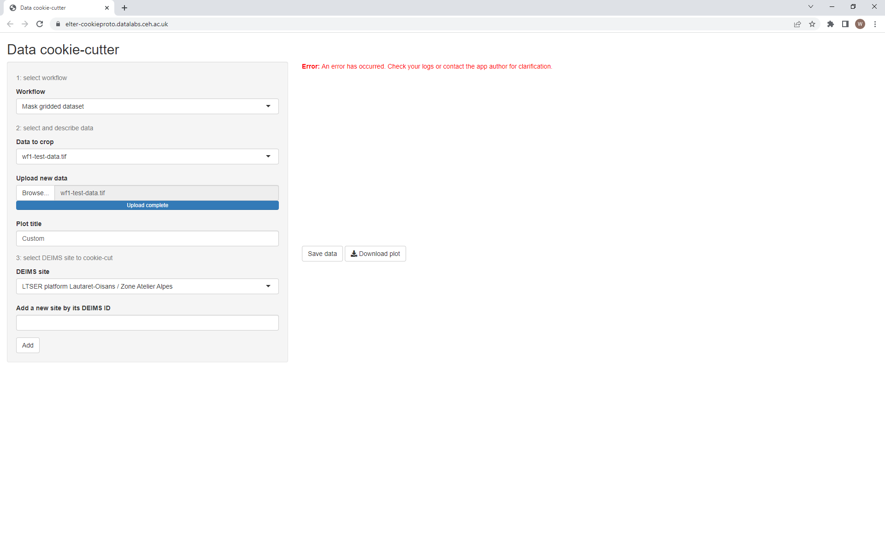

# Beginner's introduction
## Before you start
This tutorial will guide you through how to use both of the inbuilt workflows by working with example data.
It should take around 10 minutes in total.

Access to the tool, either in [datalabs](https://datalab.datalabs.ceh.ac.uk/) or by an instance you have installed yourself (see the [installation guide](documentation/howto/install.md)) is required.
You will also need to download `wf1-test-data.tif` and `scottish-births-cleaned.csv` from the top-level `data` folder if you haven't cloned the repository to your machine.

## Processing raster data with workflow 1
### Introduction
To illustrate the first workflow, we will use the `wf1-test-data.tif` file.
This is a GeoTIFF file of pollution data across the whole of the UK, where higher values in each pixel correspond to greater pollution levels.
You can open it with most standard image viewing programs or GIS software to see for yourself.

Now, imagine you're doing research into air quality in the [Cairngorms national park](https://deims.org/1b94503d-285c-4028-a3db-bc78e31dea07).
This data includes what you want (since the Cairngorms are in the UK) but also lots of data you don't need (i.e. the whole rest of the country).
Workflow 1 will extract only the pixels which fall within the boundaries of the Cairngorms and discard the rest, leaving just the data you want which you can then process further.

### Exercise
#### Data upload
Open the tool in your browser.
You will be greeted with the interface for workflow 1 on the left-hand side, as it is the default when opening the application.

Use the "Browse..." button to select the `wf1-test-data.tif` file you downloaded earlier and click upload.
You should see a plot appear like this:

#### Setting options
By default workflow 1 currently assumes you are interested in the Cairngorms national park (a relic from its early development), so as soon as the file was uploaded the system tried to extract just the data within the park's boundaries.
It succeeded because the Cairngorms is included in the extent of the uploaded data.

If you actually wanted the data for a different Deims site, all you would need to do is select the relevant site in the "Deims site" dropdown box at the bottom.
It's also possible to extract data by NUTS region boundaries by toggling the "Choose filter type" option to NUTS.
You can see this with the example data by selecting any region beginning "UK".
Again, the default NUTS regions all fall within the UK but can be changed as needed.

#### Results
Because data was extracted successfully, the resulting data is plotted to the right of the interface.
This is primarily so you can quickly check that the result is what you're expecting and catch any errors.

Since the data looks correct at a glance (look at the Cairngorms on a map!) we can now download our new dataset.
Click "Download data" and the result will be saved to your machine as `cropped-data.tif`.
You can inspect this as before to make sure that only the Cairngorms data is returned.

As a convenience, the option to download the preview plot is also made available - of course, you may prefer to create your own images with the raw data you just downloaded.
Test the generated plot by clicking "Download plot" and the preview will be saved as `plot.png`.

You can also edit the title to some extent by naming your input data under the "What is this dataset called?" heading.
The rest of the title is generated based on the options you have selected.
Enter "Pollution" in the box, wait for the plot on the screen to update and download the plot a second time.

#### Further reading
For more detailed information on how workflow 1 operates, as well as for troubleshooting tips, please read [the reference documentation](../reference/wf1.md).

## Processing tabular data with workflow 2
Coming soon...
